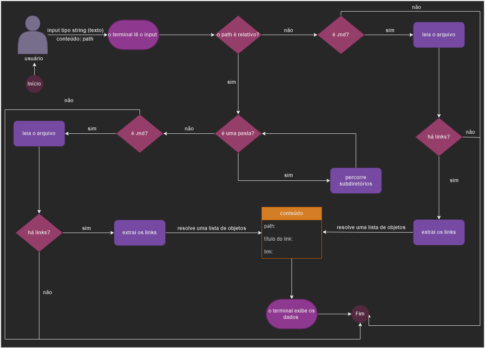
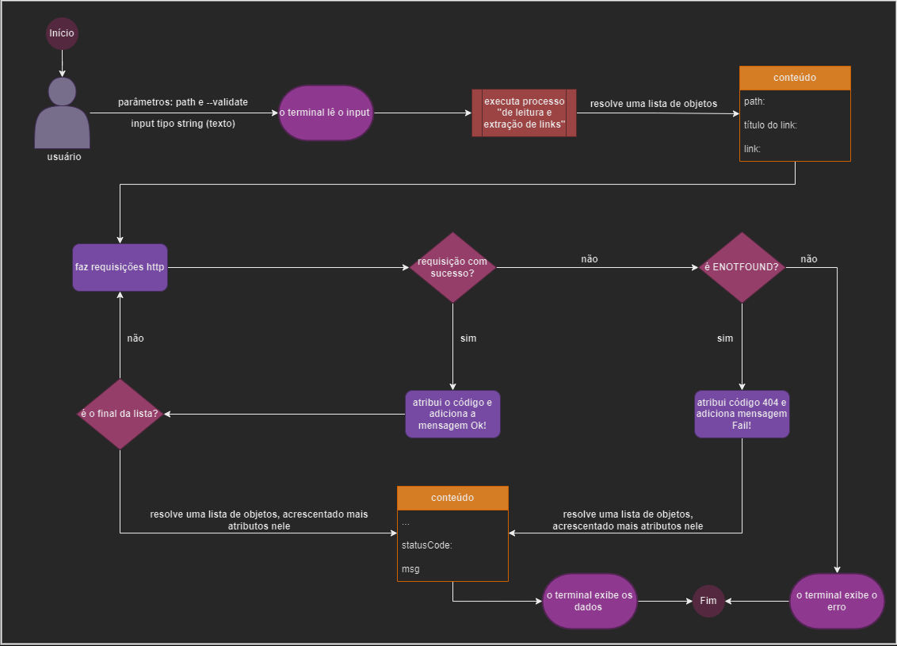
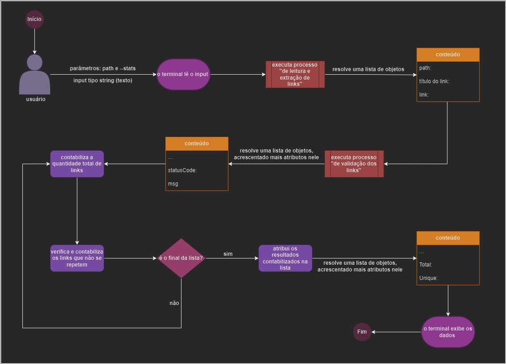
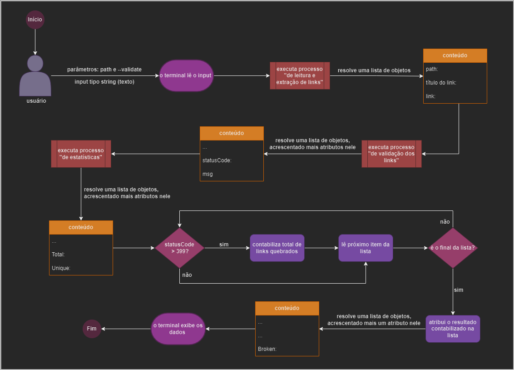
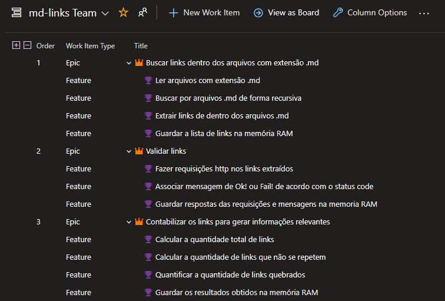
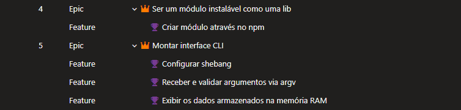

# Markdown Links

## Índice

- [Markdown Links](#markdown-links)
  - [Índice](#índice)
  - [1. Objetivo](#1-objetivo)
  - [2. Instalação da biblioteca](#2-instalação-da-biblioteca)
  - [3. Interface](#3-interface)
      - [3.1. mdLinks](#31-mdlinks)
        - [3.1.1. Parâmetros](#311-parâmetros)
        - [3.1.2. Valor de retorno](#312-valor-de-retorno)
  - [4. Guia de Uso](#4-guia-de-uso)
    - [4.1. Informando o path](#41-informando-o-path)
      - [4.1.1. Fluxograma](#411-fluxograma)
    - [4.2. Informando o path e --validate](#42-informando-o-path-e---validate)
      - [4.2.1. Fluxograma](#421-fluxograma)
    - [4.3. Informando o path e --stats](#43-informando-o-path-e---stats)
      - [4.3.1. Fluxograma](#431-fluxograma)
    - [4.4. Informando o path, --stats e --validate](#44-informando-o-path---stats-e---validate)
      - [4.4.1. Fluxograma](#441-fluxograma)
  - [5. Board com o backlog do produto](#5-board-com-o-backlog-do-produto)

***

## 1. Objetivo

Este biblioteca auxilia os usuários a encontrarem links dentro de arquivos com extensão `.md` .

## 2. Instalação da biblioteca

**Pré-requisitos:**

* instalação do noje.js versão >16;
* instalação do gitbash para utiliza-lo como ambiente de execução.

Para instalar utilize o comando:

```sh
$ npm install helouiseitokazo-md-links
```

## 3. Interface

O módulo oferece a seguinte interface:

#### 3.1. mdLinks

`mdLinks(path, options)`

##### 3.1.1. Parâmetros

* `path`: Rota absoluta ou relativa ao arquivo ou diretório.
* `options`: Um objeto com a seguinte propriedade:
  - `validate`: Um booleano que determina se deseja validar os links encontrados.
  - `stats`: Booleano que determina se deseja obter um output com informações estatísticas gerais.

##### 3.1.2. Valor de retorno

A função **retorna uma promessa** (`Promise`) que
**resolve um array** (`Array`) de objetos (`Object`), onde cada objeto representa um link, contendo as seguintes propriedades:

Apenas com o parâmetro `path`:

* `link`: URL encontrada.
* `label`: Texto que faz referência ao link.
* `path`: Rota do arquivo onde foi encontrado o link.

Com os parâmetros: `path` e `validate:true`:

* `link`: URL encontrada.
* `label`: Texto que faz referência ao link.
* `path`: Rota do arquivo onde foi encontrado o link.
* `status`: Código de resposta HTTP.
* `msg`: Mensagem `fail` em caso de falha ou `ok` em caso de sucesso.

Com os parâmetros: `path` e `stats:true`:

* `link`: URL encontrada.
* `label`: Texto que faz referência ao link.
* `path`: Rota do arquivo onde foi encontrado o link.
* `status`: Código de resposta HTTP.
* `msg`: Mensagem `fail` em caso de falha ou `ok` em caso de sucesso.
* `total`: Número total de links encontrados.
* `unique`: Número de links que não se repetem.

Com os parâmetros: `path`, `stats:true` e `validare:true`:

* `link`: URL encontrada.
* `label`: Texto que faz referência ao link.
* `path`: Rota do arquivo onde foi encontrado o link.
* `status`: Código de resposta HTTP.
* `msg`: Mensagem `fail` em caso de falha ou `ok` em caso de sucesso.
* `total`: Número total de links encontrados.
* `unique`: Número de links que não se repetem subtraindo os links quebrados.
* `broken`: Quantidade de links quebrados.

## 4. Guia de Uso

A lib deve ser usada no terminal via linha de comando, recomendamos a utilização do gitbash para evitar problemas de permissão.

Existem quatro formas de buscar por links dentro de arquivos .md usando esta lib, são elas:

### 4.1. Informando o path

O Markdown Links utiliza o comando md-links para fazer a busca e recebe como parâmetro o `path` absoluto ou relativo.

Exemplo de utilização do comando:

```sh
$ md-links ./path/arquivo.md
```

Exemplo de retorno que será exibido no terminal:

```sh
Path: path/arquivo.md
Label: Markdown
Link: https://pt.wikipedia.org/wiki/Markdown

Path: path/arquivo.md
Label: Exemplo
Link: https://pt.exemplo.org/wiki/Exemplo
```

#### 4.1.1. Fluxograma

**Cenário 1: md-links executado apenas com o parâmetro path**

**Pré-requisito:** inserir um path válido.



### 4.2. Informando o path e --validate

Exemplo de utilização do comando:

```sh
$ md-links ./path/arquivo.md --validate
```

Exemplo de retorno que será exibido no terminal:

```sh
Path: path/arquivo.md
Label: Markdown
Link: https://pt.wikipedia.org/wiki/Markdown
Status:  200
Msg:  Ok!

Path: path/arquivo.md
Label: Exemplo
Link: https://pt.exemplo.org/wiki/Exemplo
Status:  404
Msg:  Fail!
```
#### 4.2.1. Fluxograma

**Cenário 2: md-links executado com os parâmetros path e --validate**

**Pré-requisito:** inserir um path válido.



### 4.3. Informando o path e --stats

Exemplo de utilização do comando:

```sh
$ md-links ./path/arquivo.md --stats
```

Exemplo de retorno que será exibido no terminal:

```sh
Path: path/arquivo.md
Label: Markdown
Link: https://pt.wikipedia.org/wiki/Markdown
Status:  200
Msg:  Ok!

Path: path/arquivo.md
Label: Exemplo
Link: https://pt.exemplo.org/wiki/Exemplo
Status:  404
Msg:  Fail!

Total: 2
Unique: 2
```
#### 4.3.1. Fluxograma

**Cenário 3: md-links executado com os parâmetros path e --stats**

**Pré-requisito:** inserir um path válido.



### 4.4. Informando o path, --stats e --validate

Exemplo de utilização do comando:

```sh
$ md-links ./path/arquivo.md --stats --validate
```

Exemplo de retorno que será exibido no terminal:

```sh
Path: path/arquivo.md
Label: Markdown
Link: https://pt.wikipedia.org/wiki/Markdown
Status:  200
Msg:  Ok!

Path: path/arquivo.md
Label: Exemplo
Link: https://pt.exemplo.org/wiki/Exemplo
Status:  404
Msg:  Fail!

Total: 2
Unique: 1
Broken: 1
```
#### 4.4.1. Fluxograma

**Cenário 4: md-links executado com os parâmetros path. --stats e --validate**

**Pré-requisito:** inserir um path válido.



## 5. Board com o backlog do produto





